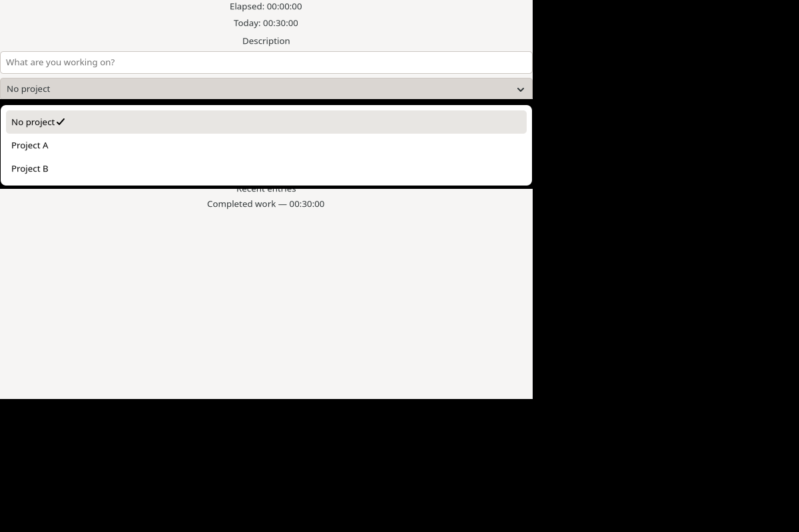

# lgtt

Time tracker GTK4 client (LLM) re-write experiment from <https://github.com/jasalt/go-time-tracker> to [let-go](https://github.com/nooga/let-go) inspired by <https://yogthos.net/posts/2026-08-29-glimmer-ui.html> using a small mechanical Go /
gotk4 host boundary.



Sibling Jolt project: <https://github.com/jasalt/jolt-time-tracker>

## Goals

- Compare performance and resource usage characteristics between let-go and Jolt (Chez Scheme)
- Compare GTK4 via [Jolt's direct FFI](https://jolt-lang.net/docs/native-interop.html) versus Go's [Gotk4 library](https://github.com/diamondburned/gotk4), including reactive UI development
- Discover upstream issues

### Takeaways so far

let-go has somewhat lighter runtime memory usage than Jolt, as seen in a rough [CLI program benchmark](https://github.com/jasalt/mdd2/blob/platform-comparison/platform-comparison/PLATFORM-COMPARISON.md), and a minimal let-go GTK4 application also requires less memory (~168 MiB RSS versus ~212 MiB RSS).

The developer-experience impact of Go as a middle layer between Gotk4 and the language, rather than direct FFI, is documented in [LET-GO-ISSUES.md](docs/LET-GO-ISSUES.md).

Linux native GTK4 on let-go is lighter than Fyne on pure Go; see [letgo-benchmarks.md](docs/letgo-benchmarks.md#gui-results).

Read more in the generated experiment documentation below.

## Build and test

```sh
scripts/build-toolchain.sh
scripts/test.sh
scripts/test-native.sh
examples/gtk-counter/smoke-test.sh
scripts/build-aot.sh
```

The release command creates `build/gtt-letgo-gtk`, a stripped standalone binary
that embeds application sources and does not require `lg` or a source checkout
at runtime. GTK4 remains a dynamic system dependency.

```sh
./build/gtt-letgo-gtk
LGTT_NREPL_PORT=7888 ./build/gtt-letgo-gtk
```

Configure Clockify or Kimai using the compatible
`${XDG_CONFIG_HOME:-~/.config}/gtt/config.json` format described by the Go
reference application. For deterministic development, a configuration
containing `{"provider":"mock"}` selects the built-in mock provider.

## Architecture

- `src/glimmer/` — GTK-free backend contract, reactive cells, and reconciler;
- `src/glimmer_gtk/` — GTK widget/property/container semantics in let-go;
- `src/gtt/` — serializable state, components, asynchronous actions,
  configuration, and provider adapters;
- `native/gtkbridge/` — retained callback and GLib scheduling conversion only;
- `cmd/gtt-letgo-gtk/` — mechanical gotk4 composition host and generated source
  embedding;
- `examples/gtk-counter/` — Gate A/Gate C callback and backend stress proof.

See:

- [`docs/letgo-baseline.md`](docs/letgo-baseline.md)
- [`docs/letgo-architecture.md`](docs/letgo-architecture.md)
- [`docs/letgo-development.md`](docs/letgo-development.md)
- [`docs/letgo-benchmarks.md`](docs/letgo-benchmarks.md)
- [`docs/LET-GO-ISSUES.md`](docs/LET-GO-ISSUES.md)

No real provider credentials or reset credits are used by automated tests.

## Coding agent sessions

- From PLAN.md to c7692a8 <https://pi.dev/session/#ebe762f3695752c2afe8e9efe645aeb8>
